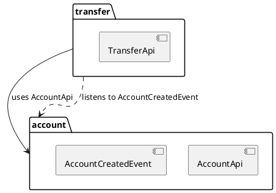

# 📖 Módulo 13: Spring Modulith (Diferencial)

> Garanta que sua arquitetura DDD seja respeitada em tempo de compilação. Poucos desenvolvedores conhecem essa ferramenta.

---

## 📚 Índice

| Seção | Tópico | Relevância |
|-------|--------|------------|
| 13.1 | O Problema do Monólito Distribuído | 🔴 Crítico |
| 13.2 | O que é Spring Modulith | 🔴 Crítico |
| 13.3 | Configuração e Testes | 🟡 Importante |
| 13.4 | Documentação Automática | 🟡 Importante |
| 13.5 | Eventos entre Módulos | 🔴 Crítico |

---

## 📚 13.1 O Problema do Monólito Distribuído

### O Cenário

```
┌─────────────────────────────────────────────────────────────────┐
│                    SEM SPRING MODULITH                           │
├─────────────────────────────────────────────────────────────────┤
│                                                                  │
│  account/                    transfer/                          │
│  ├── domain/                 ├── domain/                        │
│  │   └── Account.java        │   └── Transfer.java              │
│  └── repository/             └── service/                       │
│      └── AccountRepository       └── TransferService.java       │
│                                          │                       │
│                                          │ IMPORT DIRETO!        │
│                                          ▼                       │
│                              import account.repository.*;        │
│                              accountRepository.updateBalance();  │
│                                                                  │
│  ❌ Transfer acessou diretamente o Repository de Account!       │
│  ❌ Isso quebra o encapsulamento do módulo Account              │
│  ❌ Java não impede porque tudo é public                        │
│                                                                  │
└─────────────────────────────────────────────────────────────────┘
```

### Por que isso é ruim?

1. **Acoplamento oculto** - Você não percebe que os módulos estão acoplados
2. **Mudanças cascateiam** - Mudar Account quebra Transfer
3. **Testes difíceis** - Não consegue testar Transfer sem Account
4. **Refatoração impossível** - Extrair para microsserviço é muito difícil

---

## 📚 13.2 O que é Spring Modulith

### Definição

Spring Modulith é uma extensão do Spring que:
- **Define módulos lógicos** dentro de um monólito
- **Valida regras de arquitetura** em tempo de teste
- **Gera documentação** (C4 Model) automaticamente
- **Prepara para microsserviços** sem reescrever

### Estrutura de Módulos

```
com.pixsystem.account/          ← MÓDULO ACCOUNT
├── AccountModule.java          ← Package-info ou marker
├── api/                        ← API PÚBLICA do módulo
│   ├── AccountApi.java         ← Interface exposta
│   └── AccountCreatedEvent.java← Eventos publicados
├── internal/                   ← INTERNO (proibido acessar de fora)
│   ├── domain/
│   ├── repository/
│   └── service/
└── package-info.java

com.pixsystem.transfer/         ← MÓDULO TRANSFER
├── api/
│   └── TransferApi.java
├── internal/
│   └── ...
└── package-info.java
```

### Regras Automáticas

| Regra | Descrição |
|-------|-----------|
| **api/** | Qualquer módulo pode acessar |
| **internal/** | Somente o próprio módulo acessa |
| **Eventos** | Comunicação assíncrona entre módulos |

---

## 📚 13.3 Configuração e Testes

### Dependências

```xml
<dependency>
    <groupId>org.springframework.modulith</groupId>
    <artifactId>spring-modulith-starter-core</artifactId>
</dependency>

<dependency>
    <groupId>org.springframework.modulith</groupId>
    <artifactId>spring-modulith-starter-test</artifactId>
    <scope>test</scope>
</dependency>

<!-- Para documentação -->
<dependency>
    <groupId>org.springframework.modulith</groupId>
    <artifactId>spring-modulith-docs</artifactId>
    <scope>test</scope>
</dependency>
```

### Teste de Arquitetura

```java
@Test
void shouldBeWellStructuredModules() {
    ApplicationModules modules = ApplicationModules.of(PixAccountApplication.class);
    
    // Verifica se não há violações de acesso
    modules.verify();
}

@Test
void shouldPrintModuleStructure() {
    ApplicationModules modules = ApplicationModules.of(PixAccountApplication.class);
    
    // Imprime estrutura dos módulos
    modules.forEach(System.out::println);
}
```

### Exemplo de Violação

```java
// account/internal/repository/AccountRepository.java
public interface AccountRepository extends JpaRepository<Account, String> {}

// transfer/internal/service/TransferService.java
import com.pixsystem.account.internal.repository.AccountRepository; // ❌ PROIBIDO!

@Service
public class TransferService {
    private final AccountRepository accountRepository; // ❌ Violação!
}
```

```
# Resultado do teste:
Module 'transfer' depends on non-exposed type 
com.pixsystem.account.internal.repository.AccountRepository 
within module 'account'!
```

---

## 📚 13.4 Documentação Automática

### Gerar Documentação C4

```java
@Test
void generateDocumentation() {
    ApplicationModules modules = ApplicationModules.of(PixAccountApplication.class);
    
    // Gera diagramas PlantUML
    new Documenter(modules)
        .writeModulesAsPlantUml()
        .writeIndividualModulesAsPlantUml();
}
```

### Saída (PlantUML)



### Canvas Automático

```java
@Test
void generateCanvas() {
    ApplicationModules modules = ApplicationModules.of(PixAccountApplication.class);
    
    new Documenter(modules)
        .writeModuleCanvases(
            DiagramOptions.defaults()
                .withStyle(DiagramStyle.UML)
        );
}
```

---

## 📚 13.5 Eventos entre Módulos

### O Padrão Correto

```
┌─────────────────────────────────────────────────────────────────┐
│                    COM SPRING MODULITH                           │
├─────────────────────────────────────────────────────────────────┤
│                                                                  │
│  account/                                                        │
│  ├── api/                                                        │
│  │   ├── AccountApi.java      ← Interface pública               │
│  │   └── AccountCreatedEvent  ← Evento publicado                │
│  └── internal/                                                   │
│      └── AccountService.java                                     │
│              │                                                   │
│              │ publishes                                         │
│              ▼                                                   │
│      applicationEventPublisher.publish(new AccountCreatedEvent) │
│                                                                  │
│                         │                                        │
│                         │ Event                                  │
│                         ▼                                        │
│  transfer/                                                       │
│  └── internal/                                                   │
│      └── TransferEventListener.java                             │
│              │                                                   │
│              │ @ApplicationModuleListener                       │
│              ▼                                                   │
│      void onAccountCreated(AccountCreatedEvent event)           │
│                                                                  │
│  ✅ Comunicação via eventos (baixo acoplamento)                 │
│  ✅ Transfer não conhece detalhes internos de Account           │
│                                                                  │
└─────────────────────────────────────────────────────────────────┘
```

### Implementação

**1. Evento (API Pública do módulo Account):**

```java
// account/api/AccountCreatedEvent.java
public record AccountCreatedEvent(
    String accountId,
    String ownerCpf,
    Instant createdAt
) {}
```

**2. Publicador (Interno do módulo Account):**

```java
// account/internal/service/AccountService.java
@Service
@RequiredArgsConstructor
public class AccountService {
    
    private final AccountRepository repository;
    private final ApplicationEventPublisher eventPublisher;
    
    @Transactional
    public Account create(CreateAccountRequest request) {
        Account account = Account.create(request);
        repository.save(account);
        
        // Publica evento para outros módulos
        eventPublisher.publishEvent(new AccountCreatedEvent(
            account.getId(),
            account.getOwnerCpf().value(),
            Instant.now()
        ));
        
        return account;
    }
}
```

**3. Listener (Interno do módulo Transfer):**

```java
// transfer/internal/listener/TransferEventListener.java
@Component
@RequiredArgsConstructor
@Slf4j
public class TransferEventListener {
    
    private final TransferLimitService limitService;
    
    @ApplicationModuleListener
    public void onAccountCreated(AccountCreatedEvent event) {
        log.info("Nova conta criada: {}", event.accountId());
        
        // Inicializa limites de transferência para a nova conta
        limitService.initializeDefaultLimits(event.accountId());
    }
}
```

### Testar Eventos

```java
@ApplicationModuleTest
class AccountModuleIntegrationTest {
    
    @Autowired
    private AccountService accountService;
    
    @Autowired
    private PublishedEvents events;
    
    @Test
    void shouldPublishEventWhenAccountCreated() {
        // When
        accountService.create(new CreateAccountRequest(...));
        
        // Then
        assertThat(events.ofType(AccountCreatedEvent.class))
            .hasSize(1)
            .element(0)
            .extracting(AccountCreatedEvent::ownerCpf)
            .isEqualTo("12345678900");
    }
}
```

---

## 📚 13.6 Idempotência com AOP

### O Problema

```
Cliente clica 2x no botão "Pagar"
→ 2 requisições chegam ao servidor
→ 2 transferências são feitas?
→ ❌ PROBLEMA!
```

### Solução: @Idempotent

```java
// Annotation customizada
@Target(ElementType.METHOD)
@Retention(RetentionPolicy.RUNTIME)
public @interface Idempotent {
    String key();
    long ttl() default 24;
    TimeUnit unit() default TimeUnit.HOURS;
}
```

### Aspect

```java
@Aspect
@Component
@RequiredArgsConstructor
@Slf4j
public class IdempotencyAspect {
    
    private final RedisTemplate<String, String> redis;
    private final ObjectMapper objectMapper;
    
    @Around("@annotation(idempotent)")
    public Object checkIdempotency(ProceedingJoinPoint joinPoint, Idempotent idempotent) 
            throws Throwable {
        
        // Extrai a chave usando SpEL
        String key = resolveKey(idempotent.key(), joinPoint);
        String redisKey = "idempotency:" + key;
        
        // Verifica se já foi processado
        String cachedResult = redis.opsForValue().get(redisKey);
        if (cachedResult != null) {
            log.info("Requisição duplicada detectada: {}", key);
            return objectMapper.readValue(cachedResult, getReturnType(joinPoint));
        }
        
        // Processa a requisição
        Object result = joinPoint.proceed();
        
        // Cacheia o resultado
        String resultJson = objectMapper.writeValueAsString(result);
        redis.opsForValue().set(redisKey, resultJson, idempotent.ttl(), idempotent.unit());
        
        return result;
    }
    
    private String resolveKey(String keyExpression, ProceedingJoinPoint joinPoint) {
        // Implementar SpEL parser
        ExpressionParser parser = new SpelExpressionParser();
        StandardEvaluationContext context = new StandardEvaluationContext();
        
        // Adiciona parâmetros do método
        MethodSignature signature = (MethodSignature) joinPoint.getSignature();
        String[] paramNames = signature.getParameterNames();
        Object[] args = joinPoint.getArgs();
        
        for (int i = 0; i < paramNames.length; i++) {
            context.setVariable(paramNames[i], args[i]);
        }
        
        return parser.parseExpression(keyExpression).getValue(context, String.class);
    }
}
```

### Uso

```java
@Service
public class TransferService {
    
    @Idempotent(key = "#request.transactionId", ttl = 24, unit = TimeUnit.HOURS)
    @Transactional
    public TransferResponse transfer(TransferRequest request) {
        // Se a mesma transactionId vier de novo em 24h,
        // retorna o resultado cacheado sem executar novamente
        
        return executeTransfer(request);
    }
}
```

---

## 🎯 Perguntas de Entrevista

1. **O que é Spring Modulith?**
2. **Como evitar que um módulo acesse classes internas de outro?**
3. **Qual a vantagem de usar eventos entre módulos?**
4. **O que é idempotência? Por que é crítico em pagamentos?**
5. **Como implementar idempotência com AOP e Redis?**
6. **Qual a diferença entre um monólito bem estruturado e microsserviços?**

---

> **Próximo:** Iniciar Sprint 0 com a estrutura de módulos!
